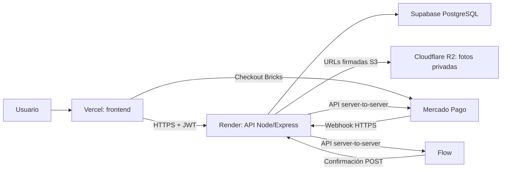

# T-Show — plan de estabilización técnica

> Estado: documento de referencia para la siguiente etapa de desarrollo.
>
> Última actualización: 25 de agosto de 2026.

## 1. Decisiones confirmadas

| Área | Decisión |
| --- | --- |
| Repositorio y CI/CD | GitHub: `thomasrojjas/t-show` (rama `main`) |
| Frontend | Vercel |
| Backend API | Render |
| Base de datos | Supabase PostgreSQL |
| Archivos/fotos | Cloudflare R2 Object Storage |
| Sesión | JWT de acceso y *refresh token*, emitidos y validados por el backend |
| Planes | Mensual y anual; precios y beneficios aún por definir |
| Pagos | Mercado Pago Checkout Bricks, integración directa de Mercado Pago e integración directa de Flow |

No se usará Neon. Tampoco se ha aprobado un módulo RAG: no es necesario para usuarios, pagos, base de datos ni fotos; se evaluará como iniciativa separada solo si se incorpora una funcionalidad de IA basada en documentos.

## 2. Arquitectura objetivo



Principios obligatorios:

- Vercel no guarda claves privadas, secretos JWT, `service_role` de Supabase ni secretos de pago.
- Render es la única capa que usa claves privadas y modifica estados de pago o suscripción.
- R2 será privado. El frontend sube/lee fotos mediante URLs prefirmadas, cortas y limitadas a un objeto y operación.
- Un `return_url` o página de éxito no confirma un pago. Solo el webhook/confirmación validado por el backend lo hace.
- Las tablas de Supabase son la fuente de verdad de usuarios, planes, pagos y permisos; el proveedor de pago es la fuente de confirmación financiera.

## 3. Identidad y acceso

### Datos de registro requeridos

Cada cuenta debe registrar y validar:

- nombre;
- apellido;
- RUT chileno (normalizado, único y con validación de dígito verificador);
- correo electrónico (normalizado a minúsculas, único y verificado);
- número de teléfono (normalizado a E.164, por ejemplo `+569...`);
- contraseña segura. Se reemplaza el modelo actual basado en `username` + PIN para cuentas de clientes.

El modelo actual contiene una base de roles (`superadmin`, `director`, `editor`, `viewer`) y JWT. Se conservarán los roles, pero el esquema de `users` debe evolucionar antes de abrir registro público.

### Sesiones JWT

- Access token de vida corta (el valor actual propuesto es 15 minutos).
- Refresh token rotativo de vida más larga (el valor actual propuesto es 7 días), asociado a sesión/dispositivo y revocable.
- El refresh token se entrega como cookie `HttpOnly`, `Secure`, `SameSite` apropiado; no se guarda en `localStorage`.
- Cambio de contraseña, cierre de sesión y suspensión de usuario invalidan sesiones vigentes.
- Contraseñas con `bcrypt`/coste configurable. Se prohíben secretos de ejemplo en producción.
- Límites de tasa y bloqueo temporal para inicio de sesión, recuperación y creación de cuentas.

## 4. Datos en Supabase

La migración existente `backend/db/migrations/001_init.sql` es un inicio técnico, pero aún no satisface el registro comercial. La siguiente migración deberá:

1. Reemplazar `username`, `pin_hash` y `display_name` como identidad de cliente por `first_name`, `last_name`, `rut`, `email`, `phone` y `password_hash`.
2. Mantener `role`, `is_active`, auditoría, intentos fallidos y bloqueo.
3. Añadir verificación de correo y, si se define, de teléfono.
4. Crear las tablas de catálogo y cobro descritas abajo.
5. Aplicar restricciones únicas y validaciones en base de datos además de validaciones del API.

### Modelo comercial mínimo

| Entidad | Datos principales |
| --- | --- |
| `plans` | código, nombre, período (`monthly`/`annual`), moneda, precio, beneficios, activo |
| `subscriptions` | usuario, plan, proveedor, estado, fecha de inicio/renovación/cancelación, id externo |
| `payment_attempts` | usuario, plan, proveedor, orden interna única, monto, moneda, estado, id externo, URLs de retorno |
| `payment_events` | proveedor, id de evento externo único, payload recibido, firma validada, resultado, fecha de procesamiento |
| `user_photos` | usuario, clave R2, tipo MIME, tamaño, fecha; nunca una clave secreta |

Los montos quedan deliberadamente sin valor hasta que negocio defina precios, impuestos, período de gracia, descuentos, reembolsos y beneficios de cada plan.

## 5. Pagos y suscripciones

### Experiencia de compra

1. El usuario autenticado elige plan mensual o anual.
2. El frontend solicita al backend crear un intento de pago, indicando el proveedor elegido.
3. El backend obtiene el precio desde `plans`, crea una orden interna inmutable y genera la sesión/preferencia/orden del proveedor.
4. El usuario completa el pago en el flujo correspondiente.
5. El proveedor avisa al webhook de Render.
6. El backend valida firma y consulta el estado al proveedor. Solo entonces registra el evento de forma idempotente, actualiza el intento y activa/renueva/cancela la suscripción.
7. El frontend consulta el estado de la suscripción; no decide autorización por parámetros de URL.

### Proveedores habilitados

| Ruta | Uso previsto | Integración |
| --- | --- | --- |
| Mercado Pago Checkout Bricks | Checkout embebido y personalizable en el frontend | El frontend usa solo la clave pública/SDK; Render crea y confirma la operación con el Access Token. |
| Mercado Pago directo | Flujo directo de Mercado Pago distinto de Bricks | Se encapsula detrás del adaptador `mercadopago`; se debe seleccionar el producto exacto al implementar (Checkout API o Checkout Pro) sin duplicar la lógica comercial. |
| Flow directo | Pago mediante la API de Flow y su URL de checkout | Render firma solicitudes con `apiKey`/`secretKey`, crea la orden y redirige al usuario a la URL devuelta por Flow. |

Para cobros recurrentes, Mercado Pago ofrece planes/suscripciones con frecuencia y monto; Flow documenta recursos de clientes, pagos y suscripciones. Antes de producción se verificará que cada cuenta comercial tenga habilitado el producto de suscripciones y los medios de pago requeridos.

### Reglas de seguridad para las pasarelas

- La elección de plan enviada por el cliente nunca define el monto: Render lo calcula desde el catálogo activo.
- Toda orden recibe un identificador interno único (`commerce_order`/`external_reference`) y una clave de idempotencia cuando la API del proveedor la soporte.
- Los webhooks se almacenan antes de procesarse, se deduplican por identificador externo y pueden reintentarse sin doble cobro ni doble activación.
- Mercado Pago: validar `x-signature` con el secreto del webhook y confirmar el objeto de pago/suscripción mediante API.
- Flow: recibir el `token` en `urlConfirmation`, firmar la consulta y recuperar el estado mediante `payment/getStatus`; no confiar únicamente en la redirección del usuario.
- Los endpoints de retorno muestran resultado al usuario, pero no activan el plan.
- Registrar auditoría de cambios de suscripción, reembolsos, contracargos y cancelaciones.

## 6. Fotos en Cloudflare R2

Flujo de carga:

1. El frontend solicita a Render una URL de carga para un tipo/tamaño permitido.
2. Render valida JWT y autorización, construye una clave no adivinable (por ejemplo `users/{userId}/avatars/{uuid}`) y crea una URL `PUT` prefirmada.
3. El navegador carga directamente a R2 sin ver credenciales R2.
4. El frontend informa término; Render valida metadata y guarda la clave en Supabase.
5. Para visualizar una foto privada, Render entrega una URL `GET` prefirmada de corta duración.

Restricciones: permitir solo imágenes, fijar lista de MIME y límite de tamaño, normalizar/transformar imágenes si se requiere, y configurar CORS del bucket exclusivamente para los dominios de Vercel y desarrollo local. Las URLs prefirmadas se tratan como credenciales temporales.

## 7. Variables de entorno

### Render (secretas salvo indicación)

```dotenv
NODE_ENV=production
CORS_ORIGIN=https://<frontend-produccion>.vercel.app
SUPABASE_URL=https://<proyecto>.supabase.co
SUPABASE_SERVICE_ROLE_KEY=<secreto>
JWT_SECRET=<secreto-largo-aleatorio>
JWT_REFRESH_SECRET=<secreto-largo-aleatorio-distinto>
JWT_EXPIRES_IN=15m
JWT_REFRESH_EXPIRES_IN=7d

R2_ACCOUNT_ID=<id-cuenta>
R2_ACCESS_KEY_ID=<secreto>
R2_SECRET_ACCESS_KEY=<secreto>
R2_BUCKET=<nombre-bucket>
R2_ENDPOINT=https://<account-id>.r2.cloudflarestorage.com

MERCADOPAGO_ACCESS_TOKEN=<secreto>
MERCADOPAGO_PUBLIC_KEY=<clave-publica-que-el-api-puede-exponer>
MERCADOPAGO_WEBHOOK_SECRET=<secreto>
FLOW_API_KEY=<secreto>
FLOW_SECRET_KEY=<secreto>
FLOW_ENV=sandbox
PAYMENTS_WEBHOOK_BASE_URL=https://<api-produccion>.onrender.com
```

### Vercel (públicas)

```dotenv
VITE_API_URL=https://<api-produccion>.onrender.com
VITE_MERCADOPAGO_PUBLIC_KEY=<clave-publica>
```

El nombre exacto de las variables de frontend se ajustará al empaquetador real del proyecto; por ahora el frontend es HTML/JavaScript estático y no debe recibir ningún secreto.

## 8. Despliegue y operación

### Vercel

- Conectar el repositorio propio `thomasrojjas/t-show`.
- Definir el directorio/artefacto de frontend según la configuración final.
- Reemplazar la URL antigua de Render que hoy está fijada en `vercel.json` por la URL del nuevo servicio.
- Configurar dominio propio, HTTPS y las variables públicas necesarias.

### Render

- Conectar el mismo repositorio y usar `backend/` como directorio raíz.
- Cambiar `CORS_ORIGIN=*` por el dominio exacto de Vercel en producción.
- Cargar secretos en el panel de Render; jamás en Git ni en `.env.example` con valores reales.
- Mantener `/api/health` sin datos sensibles y añadir comprobaciones de conectividad apropiadas.

### Supabase y R2

- Ejecutar migraciones en un proyecto Supabase de producción y separar proyecto/credenciales de desarrollo.
- Mantener RLS como defensa adicional; el backend con `service_role` debe aplicar autorización de aplicación estricta.
- Crear un bucket R2 privado, credenciales de alcance mínimo y reglas CORS explícitas.

## 9. Orden de implementación

1. Revisar y migrar el esquema de usuario; eliminar la dependencia de datos JSON para los flujos migrados.
2. Implementar registro, verificación, inicio/cierre de sesión, rotación de refresh tokens y recuperación de contraseña.
3. Incorporar catálogo de planes y el modelo de suscripciones/intentos/eventos de pago, sin precios hardcodeados.
4. Crear el adaptador común de pagos y habilitar Mercado Pago Checkout Bricks en sandbox con sus webhooks.
5. Incorporar Mercado Pago directo y Flow directo; probar estados aprobado, rechazado, pendiente, cancelado, reembolso y webhook duplicado.
6. Implementar R2 con URLs prefirmadas y validación de archivos.
7. Configurar Render/Vercel/Supabase/R2 de producción, dominios, CORS y observabilidad.
8. Ejecutar pruebas integradas, prueba de recuperación ante webhooks fallidos y validación de seguridad antes del lanzamiento.

## 10. Pendientes de negocio que bloquean producción

- Precio, moneda, impuestos y beneficios exactos de mensual/anual.
- Si cada pasarela debe soportar suscripción recurrente automática, pago único que otorga período, o ambas modalidades.
- Política de período de prueba, renovación, gracia por pago fallido, cancelación, devoluciones y facturación/boleta.
- Dominio final de frontend y URL final de backend.
- Reglas de privacidad, conservación y eliminación de fotos y datos personales.

## 11. Referencias oficiales

- [Mercado Pago: Checkout Bricks](https://www.mercadopago.cl/developers/es/docs/checkout-bricks/overview)
- [Mercado Pago: Suscripciones](https://www.mercadopago.cl/developers/es/reference/online-payments/subscriptions/overview)
- [Mercado Pago: Webhooks](https://www.mercadopago.cl/developers/es/docs/your-integrations/notifications/webhooks)
- [Flow API](https://developers.flow.cl/api)
- [Flow: primeros pasos](https://developers.flow.cl/docs/intro)
- [Cloudflare R2: URLs prefirmadas](https://developers.cloudflare.com/r2/api/s3/presigned-urls/)
